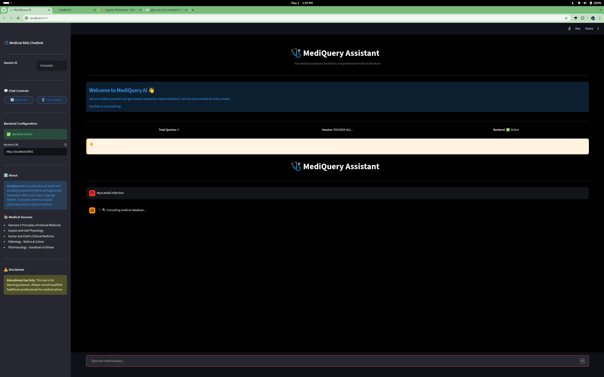
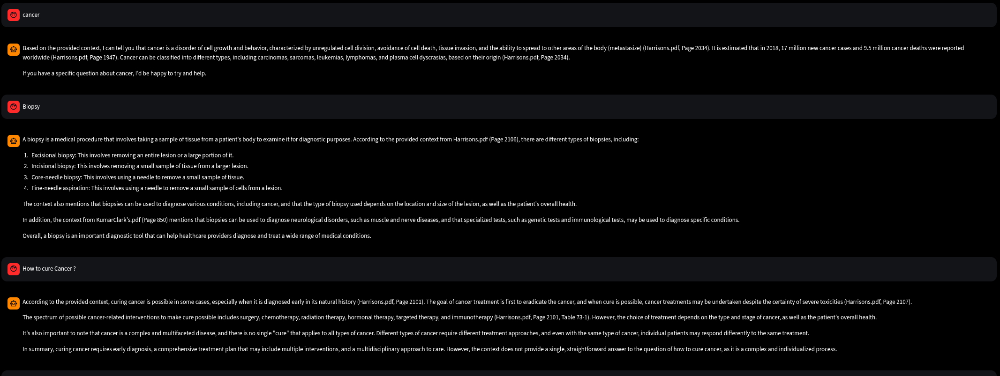

# 🩺 MediQuery AI — Medical RAG Chatbot

An AI chatbot that answers medical questions using your own PDF textbooks.  
Ask anything → it searches the books → answers with citations.

> ⚠️ **Educational use only.** Not a substitute for professional medical advice.

---

## 📸 Preview


*Main chat interface — type a medical question and get sourced answers*


*Answers with citations from books like Harrison's, Guyton, Kumar & Clark's*

---

## 🤔 What / Why / How

| | |
|---|---|
| **What** | A chatbot that reads medical PDFs and answers questions from them |
| **Why** | Study smarter — get answers with page citations instead of Googling |
| **How** | Your question → vector search in book chunks → Groq LLM generates answer |

**Stack:** FastAPI (backend) · Streamlit (frontend) · Sentence Transformers (search) · Groq Llama 3.3-70b (LLM) · SQLite (history)

---

## 📁 File Structure

```
chatbot/
├── backend/               # FastAPI REST API
│   ├── app/
│   │   ├── api/           # Routes (chat, history, health)
│   │   ├── core/          # Config & settings
│   │   ├── db/            # SQLite session
│   │   ├── models/        # DB models
│   │   ├── rag/           # RAG pipeline (embeddings, vector store, LLM chain)
│   │   ├── schemas/       # Pydantic request/response models
│   │   ├── services/      # Business logic
│   │   └── main.py        # App entry point
│   └── vector_store/      # Saved vector index (auto-generated)
│
├── frontend/              # Streamlit chat UI
│   ├── app.py             # Main UI
│   └── style.css          # Custom styles
│
├── docker/                # Docker setup
│   ├── Dockerfile.backend
│   ├── Dockerfile.frontend
│   └── docker-compose.yml
│
├── script/
│   └── ingest_doc.py      # Load PDFs into vector store
│
├── Document/              # ← Put your medical PDFs here
├── .env                   # API keys & config
└── requirements.txt
```

---

## 🚀 How to Start

### 1. Clone & setup

```bash
git clone <repo-url>
cd chatbot
python -m venv venv
source venv/bin/activate
pip install -r requirements.txt
```

### 2. Add your Groq API key

Edit `.env`:
```bash
GROQ_API_KEY=your_key_here   # Get free at https://console.groq.com/
```

### 3. Add medical PDFs & ingest

Drop PDFs into the `Document/` folder, then run:
```bash
python script/ingest_doc.py
```

### 4. Start the backend

```bash
PYTHONPATH=backend uvicorn backend.app.main:app --host 0.0.0.0 --port 8001
```
> First start takes ~10s to load the vector index. Wait for `Application startup complete.`

### 5. Start the frontend (new terminal)

```bash
source venv/bin/activate
streamlit run frontend/app.py --server.port 8501
```

### 6. Open in browser

| | URL |
|---|---|
| 💬 Chat UI | http://localhost:8501 |
| 📖 API Docs | http://localhost:8001/docs |

---

## 🐳 Docker (Alternative)

```bash
docker-compose -f docker/docker-compose.yml up -d
```
Starts both backend (`:8000`) and frontend (`:8501`) in containers.

---

## ⚙️ Key Config (`.env`)

```bash
GROQ_API_KEY=...                    # Required
LLM_MODEL=llama-3.3-70b-versatile  # Groq model
EMBEDDING_MODEL=sentence-transformers/all-MiniLM-L6-v2
TOP_K=7                             # Docs retrieved per query
TEMPERATURE=0.0                     # 0 = deterministic answers
DATABASE_URL=sqlite:///./medical_chatbot.db
```

---

## 🛠 Troubleshooting

**Backend offline in the UI?**
Check the terminal where uvicorn is running. If it shows `Vector store ready — NNNNN documents loaded`, the backend is fine — update the Backend URL in the sidebar to `http://localhost:8001`.

**0 documents loaded?**
Run `python script/ingest_doc.py` first to build the vector index.

**Slow first response?**
Normal — the model is loading. Subsequent queries are faster (caching enabled).
